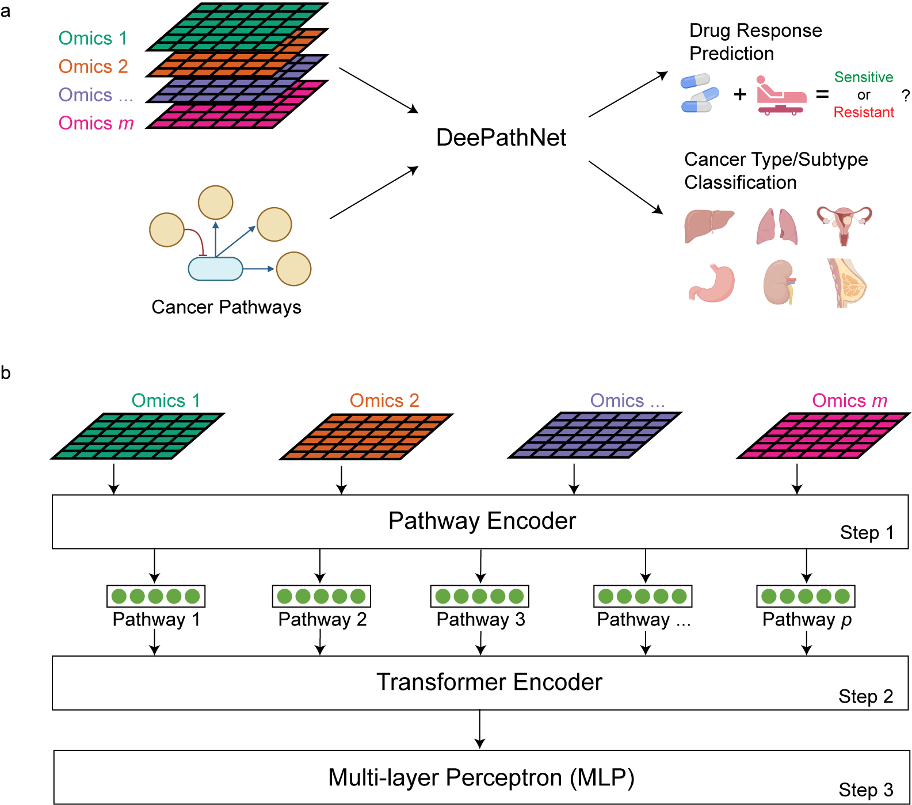

# DeePathNet
[](https://www.gnu.org/licenses/gpl-3.0)



Transformer-based deep learning integrates multi-omic data with cancer pathways.
Cai, et al., 2023

## Overview

DeePathNet is a transformer-based deep learning tool that integrates multi-omic data to improve predictions for cancer subtyping and drug response. It combines pathway-level information with deep learning to enhance precision in oncology research.

## Features
- **Multi-omic data integration** using a transformer architecture
- **Support for pathway-level feature importance analysis**
- **Pre-trained models** for cancer type classification and drug response prediction
- **Cross-validation and independent test scripts** for model evaluation

## Setting up the Coding Environment

To ensure compatibility and avoid potential issues, it is recommended to use Python 3.8 and PyTorch 1.10. Below are detailed instructions to set up the coding environment:

1. **Install Anaconda**
   - Follow the [Anaconda installation guide](https://docs.anaconda.com/free/anaconda/install/index.html) for your operating system.

2. **Create a Virtual Environment**
   - Once Anaconda is installed, create and activate a virtual environment:
     ```bash
     conda create -n deepathnet_env python=3.8 anaconda
     conda activate deepathnet_env
     ```

3. **Install PyTorch**
   - Install the appropriate version of PyTorch based on your hardware:
     - **For CUDA-enabled systems**:
       ```bash
       pip install torch==1.10.0 torchvision torchaudio --extra-index-url https://download.pytorch.org/whl/cu113
       ```
     - **For CPU-only systems**:
       ```bash
       pip install torch==1.10.0 torchvision torchaudio --index-url https://download.pytorch.org/whl/cpu
       ```

4. **Install Additional Dependencies**
   - DeePathNet requires several Python packages to run effectively. Create a `requirements.txt` file with the following contents:
     ```plaintext
     torch==1.10.0
     torchvision
     torchaudio
     numpy
     pandas
     scikit-learn
     matplotlib
     seaborn
     json5
     scipy
     tqdm
     ```
   - Install all dependencies:
     ```bash
     pip install -r requirements.txt
     ```

## Loading Pre-trained DeePathNet Model(s) with Test Data

DeePathNet provides pre-trained models and test datasets to facilitate model evaluation:

1. **Download Pre-trained Models and Test Data**
   - Access pre-trained models and test data from the [Figshare repository](https://doi.org/10.6084/m9.figshare.24137619).
   - Save the files to local directories, such as `models/` for models and `data/` for test data.

2. **Configure Paths for Models and Test Data**
   - Update the paths in the configuration file, such as:
     ```json
     {
       "model": "DeePathNet",
       "pretrained_model_path": "models/deepathnet_pretrained.pth",
       "test_data_path": "data/test_data.csv",
       "output_dir": "results/",
       ...
     }
     ```
   - Ensure that the paths in `pretrained_model_path` and `test_data_path` are correctly set to the local files.

3. **Load and Run Pre-trained DeePathNet Model**
   - DeePathNet can be run using the `deepathnet_independent_test.py` script, which loads a pre-trained model and performs inference:
     ```bash
     python scripts/deepathnet_independent_test.py configs/sanger_train_ccle_test_gdsc/mutation_cnv_rna_prot/deepathnet_mutation_cnv_rna_prot.json
     ```
   - This command will load the pre-trained model and run inference on the specified test dataset. The results will be saved to the designated output directory as specified in the configuration file.

## Running the Inference Step to Generate Predictions

The following example demonstrates how to generate predictions using DeePathNet for various tasks:

1. **Predict Drug Response**
   - To predict drug response (IC50 values), run:
     ```bash
     python scripts/deepathnet_independent_test.py configs/sanger_train_ccle_test_gdsc/mutation_cnv_rna_prot/deepathnet_mutation_cnv_rna_prot.json
     ```
   - This script reads the configuration, loads the pre-trained model, and performs inference on the test dataset.

2. **Classify Cancer Types**
   - For cancer type classification:
     ```bash
     python scripts/deepathnet_cv.py configs/tcga_all_cancer_types/mutation_cnv_rna/deepathnet_mutation_cnv_rna.json
     ```
   - This script performs cross-validation using a specified dataset and configuration file.

3. **Breast Cancer Subtyping**
   - For breast cancer subtyping:
     ```bash
     python scripts/deepathnet_independent_test.py configs/tcga_train_cptac_test_brca/cnv_rna/deepathnet_cnv_rna.json
     ```

### Output Description

- The predictions generated by DeePathNet (e.g., IC50 values or cancer subtypes) are saved in the output directory defined in the configuration file.
- The output includes performance metrics, predictions, and optional feature importance scores.

## Running Baseline Comparisons

To compare DeePathNet with baseline models like moCluster and mixOmics, use the provided scripts:

1. **moCluster Baseline Comparison**
   ```bash
   python scripts/baseline_ec_cv.py configs/sanger_gdsc_intersection_noprot/mutation_cnv_rna/moCluster_rf_allgenes_drug_mutation_cnv_rna.json
   ```
2. **Cancer Type Baseline Comparison**
   ```bash
   python scripts/cancer_type_baseline_23cancertypes.py
   ```

## Running Feature Importance Analysis

DeePathNet supports pathway-level and gene-level feature importance analysis:

1. **Pathway-level Feature Importance**
   ```bash
   python scripts/transformer_explantion_cancer_type.py configs/tcga_brca_subtypes/mutation_cnv_rna/deepathnet_allgenes_mutation_cnv_rna.json
   ```

2. **Gene-level Feature Importance**
   ```bash
   python scripts/transformer_shap_cancer_type.py configs/tcga_brca_subtypes/mutation_cnv_rna/deepathnet_allgenes_mutation_cnv_rna.json
   ```

## Data Input

The input files for DeePathNet should have samples as rows and features as columns. Features should be formatted with an underscore separating the gene name and the omic data type (e.g., `GeneA_RNA`). For example:

| Sample     | GeneA_RNA | GeneA_PROT | GeneB_RNA | GeneB_PROT |
|------------|-----------|------------|-----------|------------|
| Cell_lineA | 10        | 8          | 2         | 3          |
| Cell_lineB | 15        | 12         | 1         | 2          |
| Cell_lineC | 5         | 3          | 10        | 8          |

## Data Output

The output includes predictions such as:
- Drug response (IC50 values)
- Cancer types/subtypes
- Feature importance scores for interpretability

## Troubleshooting and Raising Issues

We recommend using the specified Python and PyTorch versions for compatibility. If issues arise, please open a ticket in the Issues tab with details about your setup, the steps you followed, and error logs.

## Contact

For more information, please contact the study authors via the associated publication.